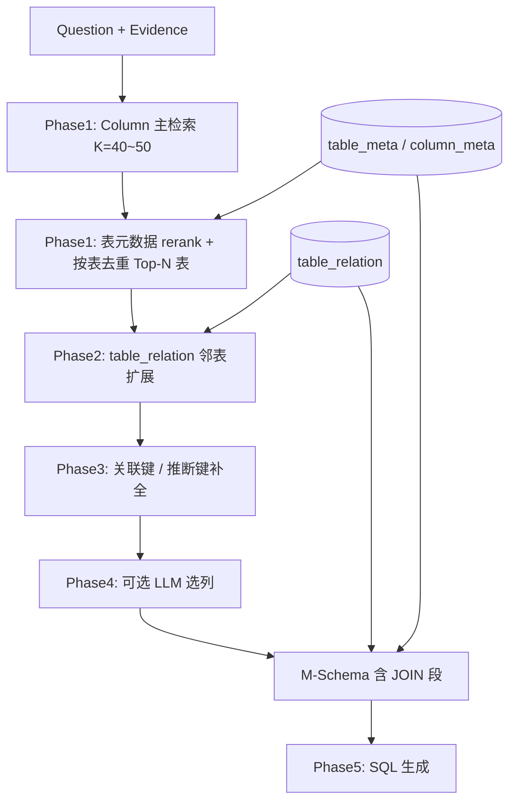

# XiYan 式 Schema 召回优化路线

> 适用：问数平台 Schema 向量召回 → M-Schema →（后续）SQL 生成  
> 约束：**业务库无物理 PK/FK**；JOIN 依赖 L1 `table_relation` + 列名启发  
> 相关：[召回测试实验操作手册](./召回测试实验操作手册.md) · [L1/L2/向量库架构](./架构-L1元数据-L2知识库-向量库.md)

---

## 1. 背景与目标

### 1.1 当前现状（2026-08 评测结论）

| 切片 | 题数 | Table Hit@10 | 说明 |
|------|------|--------------|------|
| 单表 | 40 | **100%** | 混排对单表反而有利 |
| 多表 | 60 | **~18%** | 严格双表都进 Top-10 很难 |
| 多表 Any-Table@10 | — | **~92%** | 至少中一张 must 表 |
| 合计 100 题 | 100 | **51%** | 被多表拉低 |

黄金集：`evals/golden/recall_v2.jsonl`（单表 S001–S040，多表 M001–M060）。

### 1.2 核心问题

1. **table / column 混排 Top-K**：同一张表多个字段占满槽位，第二张 must 表被挤出 K。
2. **架构文档中的 `expand_join_neighbors` 尚未实现**：命中 A 表不会沿关系补 B 表。
3. **无物理 PK/FK**：不能照搬 XiYan 的 `PFKeyIdentifier` 从库元数据自动补 JOIN。

### 1.3 优化目标

| 阶段 | 目标 |
|------|------|
| 召回阶段（当前） | 单表维持 ≥95%；多表 **Expanded Table Hit ≥70%** |
| SQL 阶段（后续） | 在 Recall 达标前提下，用选列控制 Precision，避免 prompt 过宽 |

---

## 2. XiYan Schema Filter 在做什么

XiYan 写 SQL 前经过 **Schema Filter**，不是「向量 Top-K 直接进 prompt」：

```text
Question + Evidence + 全库 Schema
        │
        ▼
┌─────────────────────────────────────┐
│  Schema Filter                       │
│  ① 多路检索 → 候选列集合 S_rtrv      │
│  ② LLM 迭代选列 → S1、S2 两份 schema │
│  ③ PFKey 补 PK/FK → JOIN 链完整      │
└─────────────────────────────────────┘
        │
        ▼
  M-Schema → 多路 SQL 生成 → 执行选优
```

### 2.1 与问数平台对照

| XiYan 环节 | 作用 | 问数现状 | 无 PK/FK 替代 |
|------------|------|----------|---------------|
| 关键词抽取 | Q+E → 实体 | 未做 | Phase 2 可选；先用整句向量 |
| **列检索** | 主召回单位 | column 向量 ✅ | **继续以 column 为主** |
| 表元数据加权 | 列分 × 表分 | table/column 混排 | Phase 1：L1 rerank，不必 table 向量混排 |
| 值检索 | WHERE 枚举/日期 | 未做 | Phase 3 可选 |
| **LLM 选列** | 压 Precision | 未做 | Phase 4（SQL 前） |
| **PFKey 扩展** | PK/FK 补 JOIN | 无物理 FK | **`table_relation` 邻表扩展** |
| M-Schema | 喂 LLM 的 schema 格式 | 已有 ✅ | FK 行来自 `table_relation` |
| 多 schema S1/S2 | Recall/Precision 权衡 | 未做 | Phase 4 |

### 2.2 关于「还要不要 table 向量」

XiYan 检索主单位是 **column**，表信息用于 **给列打分**，不是与 column 混排抢 Top-K。

| 做法 | 说明 |
|------|------|
| column embed 已含 | 表名、表中文名、表说明、字段语义 |
| table embed 独有 | `sample_questions`、整表级语义（不被某字段稀释） |
| **建议** | Phase 1 起 **table 不再与 column 混排争 K**；`sample_questions` 写入各 column 的 embed 文本，或检索后用 L1 表说明 rerank |

---

## 3. 无 PK/FK 时的关键替代：table_relation

L1 表 `table_relation` 是 **人工维护的 JOIN 图**，替代 XiYan 的 PFKey：

```sql
-- sql/templates/01_l1_core.sql
left_db, left_table, left_column,
right_db, right_table, right_column,
join_type, description
```

代码侧已有支撑：

| 能力 | 位置 |
|------|------|
| JOIN 列标注 `[关联键]` | `wenshu/services/m_schema.py` → `_fetch_join_key_columns` |
| 无 PK 逻辑键推断 | `_infer_logical_keys`（PK → UNIQUE → join_cols → cust_id 启发） |
| M-Schema 输出 JOIN 行 | `load_mschema_from_l1` + `include_relations` |
| join 向量入库 | `scripts/build_vector_index.py` → `build_join_text` |

**尚未实现**：检索后的 `expand_join_neighbors`（仅见于 [架构文档](./架构-L1元数据-L2知识库-向量库.md) 伪代码）。

---

## 4. 推荐路线总览

```text
Phase 0  补全 table_relation（地基）
Phase 1  Column 主检索 + 表去重 + 表说明 rerank
Phase 2  table_relation 邻表扩展（替代 PFKey）  ← 多表最关键
Phase 3  关联键标注 + 同名列弱扩展（辅助）
Phase 4  LLM 选列（SQL 阶段，控 Precision）
Phase 5  多候选 SQL + 执行选优（更后）
```



---

## 5. Phase 0：补全 JOIN 关系（前置，1～2 天）

**没有 PK/FK 时，这是多表召回的地基。**

### 5.1 做什么

在 L1 **元数据编辑** 或 API 中，为核心表配置 `table_relation`（建议先 **20～40 条**）：

| 左表 | 列 | 右表 | 列 | 说明 |
|------|-----|------|-----|------|
| DWD_EV_INDV_LOAN_APP | cust_id | DWD_IP_INDV_CUST_INFO | cust_id | 用信-客户 |
| DWD_EV_INDV_CRD_APP | cust_id | DWD_IP_INDV_CUST_INFO | cust_id | 授信-客户 |
| DWD_AR_LOAN_INFO | loan_no | DWD_EV_REPAY_PLAN | loan_no | 借据-还款计划 |
| DWD_AR_LOAN_INFO | prd_code | DWD_PRD_INFO | prd_code | 借据-产品 |
| DWD_EV_INDV_LOAN_PUB | duebill_no | DWD_AR_LOAN_INFO | loan_no | 出账-借据 |
| … | | | | 覆盖 15～30 张核心表 |

每条 relation 的 **description** 要写清业务含义（便于 join 向量语义匹配）。

### 5.2 验收

- [ ] `table_relation` 行数 ≥ 20，覆盖黄金集多表题主要 JOIN 对
- [ ] 增量 rebuild join 类型向量索引
- [ ] 平台「召回测试」用多表样例（如 M001）肉眼可见 join 点或扩展表

### 5.3 不做什么

- 不指望从 Hive DDL 自动发现 FK（库中本无 PK/FK 约束）

---

## 6. Phase 1：Column 主检索 + 表去重（1 周）

**目标**：对齐 XiYan「列为主、表为辅」，缓解混排抢槽；**不引入 LLM**。

### 6.1 检索流程

```text
① embed(question) → search_collection(limit=40~50)
   对象：column + join + metric + doc（table 可不参与混排）

② 从 hits 提取 (table, score)；column 命中 → 所属表计分
   table_score(T) = max(该表 column 分数) 或 top3 均值

③ 可选 XiYan 式表加权：
   final_score(T) = table_score(T) × sim(question, table.description)
   （表说明来自 L1，无需 table 向量）

④ 按 final_score 排序，取 Top-N 表（N=5~8）

⑤ 每张表回 L1 拉字段 → 拼 M-Schema（include_relations=true）
```

### 6.2 索引策略

| object_type | 建议 |
|-------------|------|
| column | **主索引，必留** |
| join | **保留** |
| metric / doc_chunk | **保留** |
| table | **弱化**：不混排抢 K；sample_questions 并入 column embed |

### 6.3 代码落点（建议）

| 模块 | 改动 |
|------|------|
| `wenshu/services/m_schema.py` | `build_mschema_from_question`：提高 limit，增加表去重 |
| 新建 `wenshu/services/schema_retrieval.py` | `retrieve_tables_for_question()` 统一召回后处理 |
| `evals/scripts/run_recall_eval.py` | 增加 **Dedupe Table Hit@30** 指标 |

### 6.4 验收

| 指标 | 目标 |
|------|------|
| 单表 Dedupe Table Hit@30 | ≥ 95%（应接近 100%） |
| 多表 Dedupe Table Hit@30 | 较 Raw @10 明显提升 |

### 6.5 对 SQL 准确率的影响

- Recall ↑（尤其多表）
- Precision 略降（表数 5～8）；靠 Phase 4 选列拉回

---

## 7. Phase 2：JOIN 邻表扩展（1 周，多表核心）

**替代 XiYan `PFKeyIdentifier`；无 PK/FK 时必须做。**

### 7.1 扩展规则

```python
def expand_join_neighbors(selected_tables, meta_engine, db_name) -> set[str]:
    expanded = set(selected_tables)
    for t in selected_tables:
        for rel in query_relations(db_name, t):  # 读 table_relation
            expanded.add(rel.other_table(t))
    return expanded
```

建议规则（按优先级）：

1. **命中表 T** → 1-hop：`table_relation` 中所有与 T 相连的表  
2. **命中 join 向量** → 直接加入 `left_table` + `right_table`  
3. **命中列 C 且 C 在某条 relation 上** → 加入 relation 对侧表（比纯表扩展更准）  
4. **上限**：扩展后总表数 ≤ 8，按与主表关联分截断  

### 7.2 与 XiYan PFKey 对照

| XiYan | 问数（无 PK/FK） |
|-------|------------------|
| 选中列 → 补 PK/FK | 选中列 → 若在 relation 上 → 补对侧表 + 关联列 |
| FK 指向另一张表 | `table_relation.right_table` |
| 复合键 | 一条 relation 一行；多列可拆多条 relation |

### 7.3 代码落点

| 模块 | 改动 |
|------|------|
| 新建 `expand_join_neighbors()` | 读 `table_relation`，建议放在 `schema_retrieval.py` |
| `build_mschema_from_question` | 去重表 → 扩展 → 再 `load_mschema_from_l1` |
| `selection_from_hits` | join 类型 hit 解析邻表（部分已有） |

### 7.4 验收

| 指标 | 目标 |
|------|------|
| 多表 **Expanded Table Hit** | ≥ 70%（依赖 Phase 0 配 relation） |
| 100 题中 M001 类 | @10 Raw 失败、Expanded 成功 |

---

## 8. Phase 3：逻辑键与同名列（3～5 天，辅助）

### 8.1 已有能力

`m_schema.py` 中 `_infer_logical_keys` 优先级：

```text
物理 PK（无）→ UNIQUE → table_relation 关联列 → cust_id / loan_no 启发式
```

### 8.2 建议

- M-Schema 默认标注 **`[关联键]`**（来自 `table_relation`）
- 扩展时：**仅当 `table_relation` 缺失**，才用同名 `cust_id` 等弱规则（低置信，需白名单）

### 8.3 禁忌

- 不把启发式 `_id` 当真 PK 自动乱 JOIN（个人/对公、授信/用信用易误连）

---

## 9. Phase 4：LLM 选列（SQL 阶段前）

**等 Phase 1～2 稳定、开始测 SQL 时再做。**

```text
输入：Question + Evidence + 候选列池（Phase 1~2 输出）
输出：minimal columns + 必须保留 relation 上的关联列
```

Prompt 约束（无 PK/FK）：

- 不得删除 `table_relation` 中的 `left_column` / `right_column`
- 不得删除扩展进来的邻表关联列

可选两档 schema（对标 XiYan S1/S2）：

| 档位 | 内容 | 用途 |
|------|------|------|
| S1 精 | LLM 严选 ~15 列 | 主 SQL 生成 |
| S2 全 | S1 + 扩展表关联列 ~30 列 | 兜底 / 第二路生成 |

---

## 10. Phase 5：SQL 生成与选优（更后）

对标 XiYan：多生成器 + 沙箱执行 + 选择模型。与召回优化正交，本文不展开。

---

## 11. 评测指标（对齐路线）

在 [召回测试实验操作手册](./召回测试实验操作手册.md) 基础上，增加：

| 指标 | 定义 | 用途 |
|------|------|------|
| Raw Table Hit@K | 混排 raw hits，must 表都在 Top-K | 诊断（现用） |
| **Dedupe Table Hit@30** | Top-30 hits **按表去重**后 must 表是否齐 | Phase 1 主指标 |
| **Expanded Table Hit** | 去重 + **table_relation 扩展**后 must 表是否齐 | Phase 2 主指标 |
| Any-Table Hit@K | 至少一张 must 表命中 | 多表诊断 |
| Forbidden@K | forbidden 表进 Top-K 比例 | 混淆监控 |

跑批命令：

```bash
python evals/scripts/run_recall_eval.py --golden evals/golden/recall_v2.jsonl
```

---

## 12. 实施优先级与工期

| 优先级 | 内容 | 工期 | 多表收益 |
|--------|------|------|----------|
| **P0** | 补全 20～40 条 `table_relation` | 1～2 天 | 地基 |
| **P1** | K=40~50 + 按表去重 + Top-8 表 | 2～3 天 | 高 |
| **P1** | 实现 `expand_join_neighbors` | 2～3 天 | **最高** |
| P2 | 弱化 table 混排；sample_questions 并入 column | 1～2 天 | 中 |
| P2 | 评测脚本增加 Dedupe / Expanded 指标 | 1 天 | 可观测 |
| P3 | 默认 `[关联键]` + relation 进 M-Schema | 1 天 | 利于 SQL |
| P4 | LLM 选列 | SQL 阶段 | Precision |

---

## 13. 风险与禁忌

| 风险 | 后果 | 对策 |
|------|------|------|
| `table_relation` 空或不全 | 扩展无效，多表永远靠碰运气 | Phase 0 必做 |
| 只靠 `cust_id` 同名启发 | 个人/对公、授信/用信误连 | 以 relation 为准，启发式兜底 |
| 去掉 table 向量且无 rerank | 纯表级问法 recall 下降 | L1 表说明 rerank |
| 扩展无上限 | 8 表变 15 表，SQL Precision 崩 | 扩展后 cap ≤ 8 表 |
| 跳过 Phase 2 直接 LLM 选列 | 候选池缺表，选列救不了 | 先扩展再选列 |
| 只加大 K 不去重 | prompt 噪声大，SQL 更差 | K 大 + 去重 + cap |

---

## 14. 与当前召回测试的关系

| 文档 / 数据 | 关系 |
|-------------|------|
| [召回测试实验操作手册](./召回测试实验操作手册.md) | 怎么出题、怎么跑 E0/E1 |
| `evals/golden/recall_v2.jsonl` | 100 题回归集（单表 40 + 多表 60） |
| 本文 | **召回链路怎么改**；改完用 v2 复测 |

阶段完成后的复测约定：

- Phase 1 完成 → 对比 Dedupe Table Hit（单表 / 多表）
- Phase 2 完成 → 对比 Expanded Table Hit
- 每次改 relation 或索引 → 必跑 `recall_v2.jsonl`

---

## 15. 一句话总结

**XiYan 式优化 ≠ 照搬 PK/FK**，在问数平台即：

```text
Column 主检索 → 表去重 + L1 表说明 rerank
            → table_relation 邻表扩展（替代 PFKey）
            → M-Schema 带 JOIN + 关联键标注
            →（SQL 阶段）LLM 选列控 Precision
```

**最先落地的两件事**：① 把 `table_relation` 配实；② 实现 Phase 1 + Phase 2 检索后处理。

---

## 16. 文档修订

| 版本 | 日期 | 说明 |
|------|------|------|
| v1.0 | 2026-08-12 | 首版：基于 recall_v2 百题评测与 XiYan Schema Filter 对照 |
