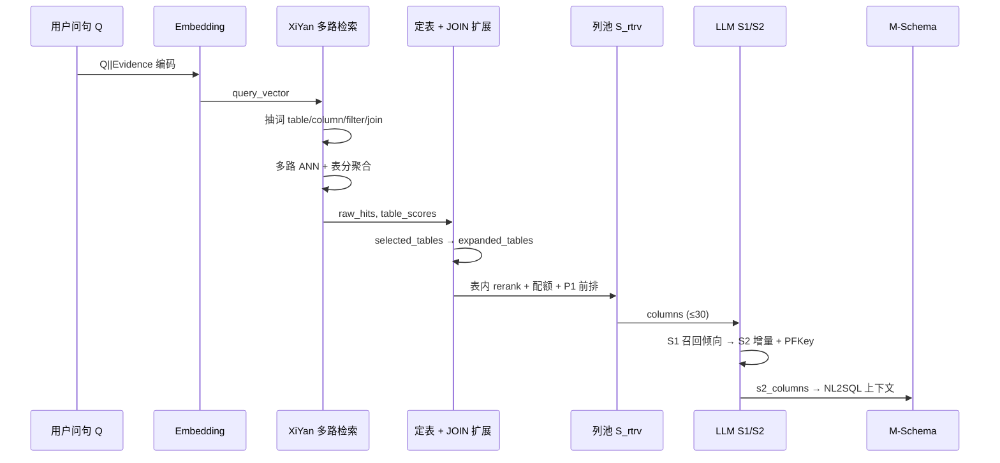

# 问数平台：架构、流程与原理说明

| 属性 | 内容 |
|------|------|
| 版本 | v1.1 |
| 更新日期 | 2026-08-28 |
| 适用代码 | 平台 v2.3+ / XiYan 召回 + 问数 Agent |
| 关联文档 | [使用说明](./使用说明.md)、[配置与参数说明](./配置与参数说明.md)、[问数Agent技术说明](./问数Agent技术说明.md)、[L1/L2/向量库架构](./架构-L1元数据-L2知识库-向量库.md)、[XiYan 优化路线](./XiYan式Schema召回优化路线.md)、[召回评测手册](./召回测试实验操作手册.md)、[PRD](./PRD-问数Agent.md) |

---

## 1. 平台定位

**问数**是一个面向信贷/数仓场景的 **NL2SQL Agent 基础设施**：把用户的自然语言问题，映射到可执行的 SQL 所依赖的 **表、字段、JOIN 关系** 与 **M-Schema 上下文**，再交给下游 LLM 生成 SQL。

核心能力分三层：

| 层次 | 做什么 | 关键产出 |
|------|--------|----------|
| **元数据治理** | 从业务库发现表结构，人工/LLM 补注释，维护 JOIN 与业务概念 | L1 MySQL 元数据库 |
| **语义索引** | 将 L1/L2 对象 embedding 写入向量库 | Qdrant `wenshu_knowledge` |
| **Schema 召回** | 问句 → 定表 → 列池 → LLM 精选 | `SchemaRetrievalResult` / M-Schema |

产品目标（MVP）见 [PRD-问数Agent.md](./PRD-问数Agent.md)：在 DWD 黄金集上 **Table Hit@10 ≥ 80%**，并持续优化 Column Hit 与泛化集表现。

---

## 2. 系统总体架构

```text
┌─────────────────────────────────────────────────────────────────────────┐
│                         问数 Web 平台 (FastAPI)                          │
│  wenshu/app.py  ·  静态 UI  ·  L1 编辑  ·  流水线  ·  召回测试  ·  NL2SQL │
└───────────────────────────────┬─────────────────────────────────────────┘
                                │
        ┌───────────────────────┼───────────────────────┐
        ▼                       ▼                       ▼
┌───────────────┐     ┌─────────────────┐     ┌─────────────────┐
│ 业务 MySQL     │     │ 元数据 MySQL     │     │ Qdrant 向量库    │
│ (RAW)         │     │ (META / L1)     │     │ wenshu_knowledge │
│ vectortest…   │     │ table/column/   │     │ column/join/     │
│ 只读采样       │     │ relation/metric │     │ table/metric/doc │
└───────────────┘     └────────┬────────┘     └────────▲─────────┘
                               │                       │
                               │    build_vector_index │
                               └───────────────────────┘
```

### 2.1 目录结构（开发视角）

| 路径 | 职责 |
|------|------|
| `wenshu/app.py` | FastAPI 入口、REST API、静态前端 |
| `wenshu/services/` | 业务核心：召回、选列、M-Schema、流水线、L1 CRUD |
| `wenshu/static/` | 管理台 UI |
| `scripts/` | CLI：索引构建、本地栈、DB 配置、种子数据 |
| `sql/` | DDL、ETL 模板 |
| `docs/` | 产品与架构文档 |
| `evals/` | 黄金集、评测脚本、报告 |
| `.wenshu/` | 运行时连接与模型配置（覆盖 `.env`） |

### 2.2 双 MySQL + Qdrant

配置见 `scripts/db_config.py`、`.env.example`：

| 存储 | 环境变量 | 默认用途 |
|------|----------|----------|
| **原始业务库** | `RAW_MYSQL_*` | 业务表数据；扫描 staging 的来源 |
| **元数据库** | `META_MYSQL_*` | L1 真相源：表/列/JOIN/指标/同义词 |
| **Qdrant** | `QDRANT_URL`, `QDRANT_COLLECTION` | 语义检索索引（COSINE，单集合 + payload 过滤） |

本地开发：`scripts/start_local_stack.ps1` 启动 MySQL **3307** + Qdrant **6333**（数据目录 `F:\wenshu-local`，不修改项目 `.env`）。

---

## 3. 元数据与向量流水线

完整 L1 表结构见 [架构-L1元数据-L2知识库-向量库.md](./架构-L1元数据-L2知识库-向量库.md) 与 `sql/metadata_schema.sql`。

### 3.1 治理流水线

```text
连接业务库 → init(DDL) → scan(暂存) → 人工/LLM 审核 → sync(L1) → index(向量)
```

编排入口：`wenshu/services/pipeline.py`

| 阶段 | API / 脚本 | 说明 |
|------|------------|------|
| **init** | `POST /api/pipeline/init` | 创建元数据表 |
| **scan** | `POST /api/pipeline/scan` | 从 RAW 库扫描到 `staging_*` |
| **审核** | `GET/PUT /api/staging/*` | 补 `description`、`synonyms`、`sample_questions` |
| **sync** | `POST /api/pipeline/sync` | staging → L1 `table_meta` / `column_meta` |
| **index** | `POST /api/pipeline/index` | `scripts/build_vector_index.py` 增量/全量 upsert |

向量构建要点（`build_vector_index.py`）：

- **嵌入对象**：`table`、`column`、`join`、`metric`、`doc_chunk`
- **embed 文本**：中文说明 + 同义词 + 表级 `sample_questions`（表向量）；列向量含表说明
- **增量**：`embed_text_hash` 变化才 re-embed，记录在 `vector_index_log`

业务概念对齐脚本（评测驱动）：`scripts/apply_concept_meta_alignment.py` — 批量更新 14 张 DWD 核心表的 L1 与列注释，然后 `--full` 重建索引。

---

## 4. Schema 召回：端到端流程

用户问题（+ 可选 Evidence）进入 **`retrieve_schema()`**（`wenshu/services/schema_retrieval.py`），输出 **`SchemaRetrievalResult`**。

### 4.1 流程总览



### 4.2 两种检索风格

| 风格 | 参数 | 行为 |
|------|------|------|
| **xiyan**（默认） | `--retrieval-style xiyan` | 关键词多路 + 表分×列分；只混排 `column` + `join` |
| **legacy** | `--legacy` | 整句单向量 ANN，table/column 混排 |

环境变量：`SCHEMA_KEYWORD_MODE=auto|llm|rule`（`keyword_llm.py` + `query_intent.py`）。

---

## 5. XiYan 式召回原理（核心）

设计参考 XiYan-SQL 的 Schema Filter 思路，详见 [XiYan式Schema召回优化路线.md](./XiYan式Schema召回优化路线.md)。

### 5.1 Phase A：关键词与多路检索

1. **抽词**（`extract_roles_resolved`）：将问句拆成 `table_phrases`、`column_phrases`、`filter_phrases`、`join_phrases`
2. **整句向量**：`sim(Q, column)` 大池（默认 80 条）用于 **定表** `table_scores`
3. **短语向量**：每条 keyword 单独 ANN，按 role 加权合并

**列分公式（Phase B）**：

```text
score(col) = table_sim(table) × kw_sim(hit) × role_weight × column_scale
table_sim  = max(table_q_scores[table], XIYAN_TABLE_SIM_FLOOR)
```

role 权重示例：`column=1.0`, `filter=0.92`, `table=1.12`, `join=1.08`。

### 5.2 定表：table_scores → selected_tables

| 概念 | 变量/字段 | 含义 |
|------|-----------|------|
| **table_scores** | `SchemaRetrievalResult.table_scores` | 各表聚合分（column/join hit + 短语 boost） |
| **hint_tables** | 内部 | 业务概念、L1 同义词、向量 payload 推断的提示表 |
| **selected_tables** | 结果字段 | Top-N 定表（默认 N=8），**扩展前** |
| **pick_focus_table** | 函数 | 单表问句时聚焦一张核心表 |

`quota_core` 排序用 hint 优先 + selected 顺序，**不直接读 table_scores 数值**（避免过拟合分数）。

### 5.3 JOIN 邻表扩展：expanded_tables

**`expand_join_neighbors()`** 沿 L1 `table_relation` 做 1-hop 扩展，得到 **`expanded_tables`**（上限默认 12 张）。

- 多表路径：保证 JOIN 可达
- 单表路径：可跳过扩展，聚焦单表列覆盖

**评测主 KPI（V2）**：`must_tables ⊆ expanded_tables` → **Table Hit**（与 Top-K 列槽解耦，见 §7）。

### 5.4 列池 S_rtrv：配额与 P1 前排

在 `expanded_tables` 内：

1. **`_rerank_columns_by_table_from_qdrant`**：每表内向量 rerank，补全高分列
2. **概念注入**（`business_concept.py`）：匹配业务概念 → inject 相关列（提分因子，非 hard pin 全表）
3. **`_select_columns_with_table_quota`**：多表列配额，输出 **`columns`**（即 **S_rtrv**，默认 cap **30** 列）

**P1 前排组装**（`_assemble_col_hit_front`，前 10 槽）：

- keyword **pin**（≤3 条）
- **每张核心表至少 1 列**进前排（保 Table 与列槽平衡）
- tail 动态 `min_per`（2 表→每表 3 列，3 表→每表 2 列等）

设计原则：**不为 Col@10 过度 pin**，否则三表题会挤掉第三张表（伤 Table）。

### 5.5 业务概念层

`wenshu/services/business_concept.py`：

- L1 检索词典：概念名 ↔ 别名
- **`build_concept_hint_block`**：注入 LLM 选列 prompt（易混淆表/字段说明）
- 列匹配 **`column_matches_concept`**：用于 inject，**不对英文字段名硬绑物理表**

表级 **`sample_questions`**（`table_meta`）：示例问法，写入表向量 embed 文本，帮助定表。

---

## 6. LLM 两轮选列（S1 / S2）

开关：`SCHEMA_COLUMN_SELECT=1`（默认开）。实现：`wenshu/services/column_selection.py`。

```text
S_rtrv (检索池，~30 列)
        │
        ▼
   ┌─────────┐
   │   S1    │  第 1 轮 LLM：召回倾向 / 覆盖 must 语义
   └────┬────┘
        ▼
   ┌─────────┐
   │   S2    │  S1 ∪ 第 2 轮增量 ∪ PFKey ∪ widen 启发式
   └─────────┘
```

| 概念 | 说明 |
|------|------|
| **S1** | 从 S_rtrv 中选「与问句最相关」的列集合 |
| **S2** | 在 S1 基础上补 JOIN 键、概念列、空结果 widen |
| **PFKey** | 无物理 FK 时，按 L1 `table_relation` 补 JOIN 两端键列 |
| **widen** | S2 为空或缺列时，按概念/表内高分列启发式补全 |

**重要约束**：S2 **只能从 S_rtrv 里选** — 池外列进不了 S2，故 **Col@30 / 池子质量** 是 S2 上限。

M-Schema 构建（`m_schema.py`）优先使用 **`s2_columns`**，fallback `s1` → 全池。

---

## 7. 评测体系

脚本：`evals/scripts/run_recall_eval.py`  
黄金集：`evals/golden/recall_v2_dwd.jsonl`（77 题回归）、`recall_dwd_standalone_100.jsonl`（100 题泛化）。

### 7.1 黄金集字段

| 字段 | 含义 |
|------|------|
| `must_tables` | 必须召回的表 |
| `must_columns` | 必须出现的字段 `{table, column}` |
| `forbidden_tables` | 不应进 Top 的易混淆表 |
| `suite` | `single` / `multi` |

### 7.2 V2 主指标（当前默认，已解耦）

| 指标 | 定义 | 反映什么 |
|------|------|----------|
| **Table Hit@K** | `must_tables ⊆ expanded_tables` | **定表**是否正确（与 K 无关） |
| **Column Hit@K** | `must_columns ⊆ 前 K 个列槽` | **列排序**（前 K 槽） |
| **Any-Table Hit@K** | must 与 expanded 有交集 | 弱定表 |
| **Forbidden@K** | forbidden 出现在 **前 K 列反推表** | 易混淆污染 |

**对照指标**（报告附录）：

| 指标 | 定义 |
|------|------|
| `slot_table_hit` | 旧口径：前 K **列槽反推表** ⊇ must_tables |
| `supplemented_column_hit` | must_columns ⊆ 全输出池（~30 列） |
| `selected_table_hit` | must ⊆ selected_tables（扩展前） |
| **S1/S2 Column Hit** | must_columns ⊆ S1/S2 全集（**非 Top-K**，列数不固定） |

### 7.3 典型运行

```bash
# 本地栈
powershell scripts/start_local_stack.ps1

# 元数据对齐 + 全量索引
python scripts/apply_concept_meta_alignment.py
python scripts/build_vector_index.py --full

# 77 题回归
python evals/scripts/run_recall_eval.py \
  --golden evals/golden/recall_v2_dwd.jsonl \
  --retrieval-style xiyan --keyword-mode auto --limit 30

# 100 题泛化
python evals/scripts/run_recall_eval.py \
  --golden evals/golden/recall_dwd_standalone_100.jsonl \
  --retrieval-style xiyan --keyword-mode auto --limit 30
```

报告输出：`evals/reports/recall_XIYAN_*.md` + `.json`。

### 7.4 当前水位（2026-08-24，meta 第四批 + 评测解耦后）

| 指标 | 77 题 | 100 题 |
|------|-------|--------|
| Table@10（expanded） | 97.4% | 93.0% |
| Column@10 | 67.5% | 59.0% |
| Column@30 | 88.3% | 78.0% |
| S2 Column | 90.9% | 86.0% |

解读：**定表已接近可用**；瓶颈在 **多表列池 / 前 10 槽** 与 **loan_pub 等弱表未进 expanded**。

---

## 8. API 与运维入口

### 8.1 启动平台

```bash
python scripts/run_platform.py   # 默认 http://127.0.0.1:8765
```

### 8.2 主要 HTTP API（`wenshu/app.py`）

| 路由 | 作用 |
|------|------|
| `POST /api/pipeline/{init,scan,sync,index,run-all}` | 元数据流水线 |
| `GET/PUT /api/l1/*` | 表、列、JOIN、指标、同义词、文档 |
| `GET/PUT /api/staging/*` | 暂存扫描结果与 LLM 补注释 |
| **`POST /api/search/test`** | 在线召回测试（调 `retrieve_schema`） |
| **`POST /api/nl2sql/mschema`** | 问句 → M-Schema 文本 |
| **`POST /api/nl2sql/prompt`** | 完整 NL2SQL Prompt |
| **`POST /api/agent/query`** | 问数 Agent 全链路 |
| **`POST /api/agent/approve`** | 敏感 SQL 人工审批 resume |
| `GET/PUT /api/model-settings` | Embedding / LLM 配置 |
| `GET/PUT /api/connections/*` | 数据库连接 |

### 8.3 常用 CLI

| 命令 | 用途 |
|------|------|
| `python scripts/build_vector_index.py [--full]` | 构建/重建向量 |
| `python scripts/apply_concept_meta_alignment.py` | DWD 概念 meta 对齐 |
| `python evals/scripts/run_recall_eval.py` | 批量召回评测 |
| `python evals/scripts/run_sql_eval.py` | 召回 + SQL 联合评测 |
| `python evals/scripts/attach_gold_sql.py` | 为黄金集生成 gold_sql |
| `python scripts/init_platform_schema.py` | 初始化元数据 DDL |

---

## 9. 配置要点

完整参数见 **[配置与参数说明.md](./配置与参数说明.md)**。常用项：

| 变量 | 默认 | 说明 |
|------|------|------|
| `SCHEMA_KEYWORD_MODE` | auto | 关键词：LLM 优先，失败回退规则 |
| `SCHEMA_COLUMN_SELECT` | 1 | 是否启用 S1/S2 |
| `AGENT_SQL_MULTI_CANDIDATE` | 1 | M7 首轮多候选（icecoding 默认） |
| `AGENT_SQL_XIYAN_PIPELINE` | 0 | XiYan 执行选优流程（可选） |
| `EMBEDDING_PROVIDER` | openai / local | 向量模型 |
| `QDRANT_COLLECTION` | wenshu_knowledge | 集合名 |

平台 UI 写入的 `.wenshu/model_settings.json`、`.wenshu/connections.json` **优先于** `.env`。

---

## 9.1 问数 Agent（概要）

端到端编排见 **[问数Agent技术说明.md](./问数Agent技术说明.md)**。SQL 生成两条路径：

| 路径 | 开关 | 说明 |
|------|------|------|
| icecoding（默认） | `AGENT_SQL_XIYAN_PIPELINE=0` | 确定性编译 → 多候选 AST 打分 → M8/M10 重试 |
| XiYan 可选 | `AGENT_SQL_XIYAN_PIPELINE=1` | S1/S2 双 schema + 执行聚类选优 |

---

## 10. 关键设计决策（原理摘要）

1. **L1 是真相源，向量库是索引** — 注释/JOIN/概念改 L1 后必须 rebuild index。
2. **V2 不用 table 点混排** — 定表靠 column/join 聚合 + hint，避免表向量与列向量抢 K。
3. **Table 与 Column 评测解耦** — Table 看 `expanded_tables`，Col 看列槽；避免「为排前列伤定表」。
4. **S2 上限 = S_rtrv** — 先修池子再调 Prompt；Col@30 是 S2 的天花板。
5. **sample_questions 是表级问法** — 帮定表；列级靠 `column_meta.description` + synonyms。
6. **双黄金集** — 77 题回归防退化，100 题独立泛化防过拟合。

---

## 11. 文档索引

| 文档 | 内容 |
|------|------|
| [使用说明.md](./使用说明.md) | 平台功能、工作流、API |
| [配置与参数说明.md](./配置与参数说明.md) | 环境变量与调参 |
| [问数Agent技术说明.md](./问数Agent技术说明.md) | Agent 编排、与 icecoding 对比 |
| [架构-L1元数据-L2知识库-向量库.md](./架构-L1元数据-L2知识库-向量库.md) | 三层存储、DDL、embed 细节 |
| [XiYan式Schema召回优化路线.md](./XiYan式Schema召回优化路线.md) | 优化项路线图、Phase 划分 |
| [召回测试实验操作手册.md](./召回测试实验操作手册.md) | 评测操作、失败标签、指标解读 |
| [元数据自动发现与向量入库指南.md](./元数据自动发现与向量入库指南.md) | 扫描、staging、入库 SOP |
| [平台建设历程.md](./平台建设历程.md) | 项目演进时间线 |
| [PRD-问数Agent.md](./PRD-问数Agent.md) | 产品范围与非目标 |
| [DWS层生成语句.md](./DWS层生成语句.md) | DWS ETL 与源表依赖 |

---

## 12. 术语表

| 术语 | 含义 |
|------|------|
| **L1** | MySQL 元数据库：表/列/JOIN/指标 |
| **L2** | 知识库文档 chunk，RAG 补充口径 |
| **S_rtrv** | `retrieve_schema` 输出的列池（≈limit 30） |
| **expanded_tables** | JOIN 扩展后的定表集合 |
| **table_scores** | 表级相似度聚合分 |
| **P1 前排** | 输出列前 10 槽的 pin/每表保 1 列逻辑 |
| **PFKey** | 按 L1 JOIN 边补全关联键列 |
| **M-Schema** | 供 NL2SQL 使用的结构化 schema 文本 |
| **黄金集** | 带 must_tables/columns 的评测问句集 |

---

*本文档由代码库现状整理，随实现变更需同步更新 `retrieve_schema` 常量与评测口径。*
